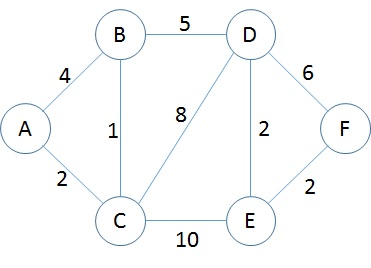

<h1 align="center">Algoritmo de Dijkstra</h1>
<h3 align="center">Prof. Eduardo Ono</h3>
<h5 align="center">Atualizado em: 03/Out/2024</h5>

&nbsp;

## Exemplo

Considerando o vértice _A_ como o início _S_, determinar o caminho mínimo para os outros vértices.

Pivô = A

| Vértice | Distância mínima | Caminho |
|:-------:|:----------------:|:--------|
|    A    |        0         | A       |
|    B    |        4         | A -> B  |
|    C    |        2         | A -> C  |

Pivô = C (Vértice com a menor distância de _S_ = _A_ até o momento)

| Vértice | Distância mínima | Caminho     |
|:-------:|:----------------:|:------------|
|    A    |        0         | A           |
|    B    |        3         | A -> C -> B |
|    C    |        2         | A -> C      |
|    D    |        10        | A -> C -> D |
|    E    |        12        | A -> C -> E |

Pivô = B

| Vértice | Distância mínima | Caminho          |
|:-------:|:----------------:|:-----------------|
|    A    |        0         | A                |
|    B    |        3         | A -> C -> B      |
|    C    |        2         | A -> C           |
|    D    |        8         | A -> C -> B -> D |
|    E    |        12        | A -> C -> E      |

Pivô = D

| Vértice | Distância mínima | Caminho               |
|:-------:|:----------------:|:----------------------|
|    A    |        0         | A                     |
|    B    |        3         | A -> C -> B           |
|    C    |        2         | A -> C                |
|    D    |        8         | A -> C -> B -> D      |
|    E    |        10        | A -> C -> B -> E      |
|    F    |        14        | A -> C -> B -> D -> F |

Pivô = E

| Vértice | Distância mínima | Caminho               |
|:-------:|:----------------:|:----------------------|
|    A    |        0         | A                     |
|    B    |        3         | A -> C -> B           |
|    C    |        2         | A -> C                |
|    D    |        8         | A -> C -> B -> D      |
|    E    |        10        | A -> C -> B -> E      |
|    F    |        12        | A -> C -> B -> E -> F |

&nbsp;

## Representação de um Grafo Ponderado através de Matriz de Adjacência

|   |  A  |  B  |  C  |  D  |  E  |  F  |
|:-:|:---:|:---:|:---:|:---:|:---:|:---:|
| A |  0  |  4  |  2  | INF | INF | INF |
| B |  4  |  0  |  1  |  5  | INF | INF |
| C |  2  |  1  |  0  |  8  | 10  | INF |
| D | INF |  5  |  8  |  0  |  2  |  6  |
| E | INF | INF | 10  |  2  |  0  |  2  |
| F | INF | INF | INF |  6  |  2  |  0  |

INF é um número grande. Maior que a soma de todos os elementos (não INF) da matriz.

&nbsp;
