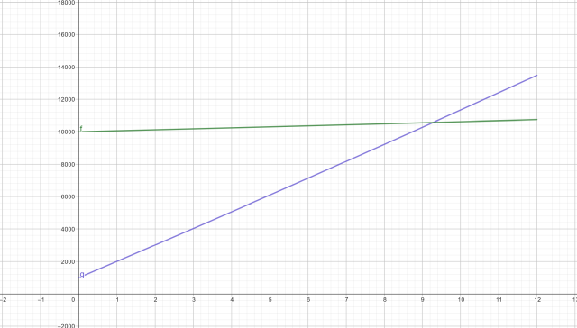

<h1 align="center">Juros Compostos com Aportes</h1>
<h3 align="center">Prof. Eduardo Ono</h3>
<h5 align="center">Atualizado em: 21/10/2024</h5>

&nbsp;

## Fórmula dos Juros Compostos com Aporte

Para aportes, a fórmula dos __*Juros Compostos com Aporte*__ considera um aporte (geralmente mensal) sempre do mesmo valor.

* Fórmula:

$$
\boxed{\ M = C \cdot \cfrac{(1 + j)^t - 1}{j} \ }
$$

onde $M$ é o montante, $C$ o aporte, $j$ a taxa de juros e $t$ o tempo (duração da aplicação).

## Exemplo

Para uma aplicação de R\$ 1.000,00 (capital) na Caderneta de Poupança a uma taxa de 0,6\% ao mês, aporte mensal de R\$ 1.000,00, o montante após 1 ano (12 meses) será:

$C$ (R\$) = 1.000,00 
$j$ (a.m.) = 0,6% = 0,6/100 = 0,006 
$t$ (meses) = 12 
$M$ (após 1 ano) = ?

$$
\begin{align*}
M_{12} &= 1000 \cdot \cfrac{(1 + 0.006)^{12} - 1}{0.006} \\
M_{12} &= \text{12.404,03}
\end{align*}
$$

| Meses | $M = C \cdot \cfrac{(1 + j)^t - 1}{j}$ |
| :-: | --: |
| 0 |     0,00 |
| 1 | 1.000,00 |
| 2 | 2.006,00 |
| ... | ... |
| 11 | 11.336,01 |
| 12 | 12.404,03 |

&nbsp;

## Gráfico (GeoGebra)

* Juros compostos sem aporte (C = R\$ 10.000,00) vs juros compostos com aporte mensal (C = R\$ 1.000,00)

## Aportes com valor diferente do capital

$$
\boxed{\ M = C \cdot (1 + j)^t + A \cdot \cfrac{(1 + j)^t - 1}{j} \ }
$$

### Exemplo

$C$ (R\$) = 1.000,00 
$j$ (a.m.) = 0,6% = 0,6/100 = 0,006 
$t$ (meses) = 12 
$M_{12}$ = ?

| Meses | $M = C \cdot (1 + j)^t + A \cdot \cfrac{(1 + j)^t - 1}{j}$ |
| :-: | --: |
| 0 |  1.000,00 |
| 1 |  2.006,00 |
| 2 |  3.018,04 |
| ... | ... |
| 11 | 12.404,03 |
| 12 | 13.478,45 |

&nbsp;

## Vídeos de Apoio

| Thumb | Descrição |
| --- | --- |
|  | [Excelente João] [__Como Calcular Juros Simples, Compostos e Com Aporte Mensal no Excel \| Planilha de Investimentos__](https://www.youtube.com/watch?v=6p6LPJHvKEY) (20:32, YouTube, 29/Nov/2022) |

&nbsp;

## Referências

* <https://forex-social.com/ferramentas/calculadora-lucros-aportes/>
