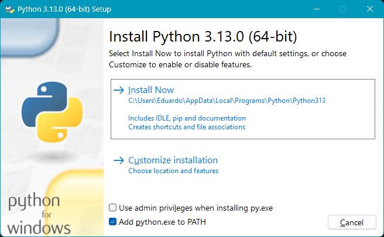

<h1 align="center">Python :: Ambiente de Desenvolvimento</h1>
<h3 align="center">Prof. Eduardo Ono</h3>
<h5 align="center">Atualizado em: 15/10/2024</h5>

&nbsp;

## Instalação do Interpretador do Python

* Instalar a versão 3.13.0 ou superior.

* Download do instalador

  * <https://www.python.org>

* Na primeira tela do instalador, marcar a opçao "__Add python.exe to PATH__".

  

* Continuar a instalação com a opções "default".

* Verificar se a instalação do interpretador do Python foi realizada corretamente.

  * Abir o Terminal e digitar

  `python --version`

&nbsp;
