Estudos Especiais em Matemática e suas Tecnologias

&nbsp;

<h1 align="center">Exemplos de Quadrados Mágicos</h1>
<h4 align="center">Prof. Eduardo Ono</h4>
<h6 align="center">Atualizado em: 19/11/2024</h6>

&nbsp;

## Exemplos

| Exemplo | Versão Online |
| --- | :-: |
| Método de Sião | [link](https://eduardo-ono.github.io/Estudos-Avancados-em-Matematica-e-suas-Tecnologias/desenvolvimento-de-sistemas-mtec-pi/2024-2o-ano/conteudo/quadrados-magicos/exemplos/metodo-de-siao.html) |
| Quadrado Mágico de Ramanujan | [link](https://eduardo-ono.github.io/Estudos-Avancados-em-Matematica-e-suas-Tecnologias/desenvolvimento-de-sistemas-mtec-pi/2024-2o-ano/conteudo/quadrados-magicos/exemplos/ramanujan.html) |

&nbsp;

## Arquitetura da Aplicação

```mermaid
graph TB
    subgraph HTML[Arquivos HTML]
      subgraph SIAO[metodo-de-siao.html]
        button1("button id=&quot;quadrado&quot;")
        button2("button id=&quot;metodo-de-siao&quot;")
        quadrado-container-siao("&quot;quadrado-container&quot;")
      end
      subgraph 6[ramanujan.html]
        button-ramanujan("button id=&quot;button-ramanujan&quot;")
        quadrado-container-ramanujan("div id=&quot;quadrado-container&quot;")
      end
    end
    subgraph CONTROLLER["controller.js"]
      _criarQuadrado(["_criarQuadrado(N)"])
      _metodoDeSiao(["_metodoDeSiao()"])
      _ramanujan(["_ramanujan()"])
    end
    subgraph JS[Arquivos JavaScript]
      criarQuadrado("criarQuadrado()")
      metodoDeSiao("metodoDeSiao()")
      subgraph 4-1[ramanujan.js]
        ramanujan("ramanujan()")
      end
    end
    button1 -->|1| _criarQuadrado
    _criarQuadrado <-->|2| criarQuadrado
    _criarQuadrado -->|3| quadrado-container-siao
    button2 <-->|4| _metodoDeSiao

    _metodoDeSiao <--> metodoDeSiao
    _criarQuadrado --> quadrado-container-siao

    button-ramanujan --> _ramanujan
    _ramanujan --> _criarQuadrado
    _ramanujan <--> ramanujan
    _criarQuadrado --> quadrado-container-ramanujan


style HTML fill:#323232,stroke:#FFFFFF,stroke-width:2px
style CONTROLLER fill:#202020,stroke:#FFFFFF,stroke-width:1px
style JS fill:#323232,stroke:#FFFFFF,stroke-width:2px
linkStyle 0,1,2 stroke-width:2px,fill:none,stroke:red;

```

