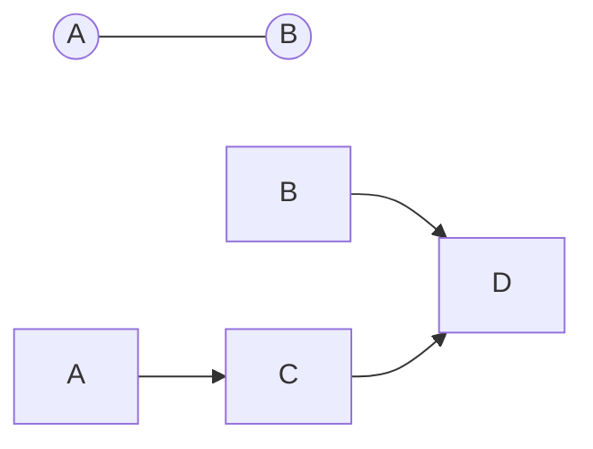

<h1 align="center">Grafos</h1>
<h3 align="center">Prof. Eduardo Ono</h3>
<h5 align="center">Atualizado em: 02/11/2024</h5>

&nbsp;

## Sumário

* ### [Representações de Grafos](./representacoes-de-grafos/)

  * Matriz de Adjacências

* ### [Algoritmo de Dijkstra](./algoritmo-de-dijkstra/)

&nbsp;

## Exemplos

&nbsp;
