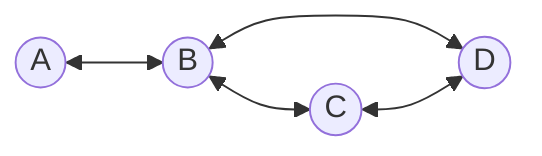

Estudos Avançados em Matemática e suas Tecnologias

&nbsp;

<h1 align="center">Definições</h1>
<h4 align="center">Prof. Eduardo Ono</h4>
<h6 align="center">Atualizado em: 02/12/2024</h6>

&nbsp;

## Teoria dos Grafos

A __*Teoria dos Grafos*__ é um ramo da matemática que estuda as relações entre os objetos de um determinado conjunto. Para tal são utilizadas estruturas chamadas de grafos.

__*Grafos*__ são estruturas que mapeiam relações entre objetos. Esses objetos são denominados vértices (ou nós) e as conexões entre eles são denominadas arestas (ou arcos).

### Exemplo

### Vídeos de Apoio

| Thumb | Descrição |
| :-: | --- |
|  | [Bóson Treinamentos] [__O que é a Teoria dos Grafos - Introdução - 01__](https://www.youtube.com/watch?v=dVXP8lAcE7M) (14:00, YouTube, 13/Out/2022) |

&nbsp;
