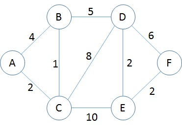

<h1 align="center">Representações de Grafos</h1>
<h3 align="center">Prof. Eduardo Ono</h3>
<h5 align="center">Atualizado em: 02/11/2024</h5>

&nbsp;

## Representação de um grafo ponderado através de Matriz de Adjacência

Na matriz de Adjacência (ou Matriz de Adjacências) cada elemento corresponde ao peso da aresta que conecta dois vértices. Quando não há uma conecção direta entre dois vértices, o elemento recebe o valor zero. O valor entre um mesmo vértice, por exemplo, entre o vértice _A_ e _A_, _B_ e _B_, etc., também é zero.

|   | A | B | C  | D | E  | F |
|:-:|:-:|:-:|:--:|:-:|:--:|:-:|
| A | 0 | 4 | 2  | 0 | 0  | 0 |
| B | 4 | 0 | 1  | 5 | 0  | 0 |
| C | 2 | 1 | 0  | 8 | 10 | 0 |
| D | 0 | 5 | 8  | 0 | 2  | 6 |
| E | 0 | 0 | 10 | 2 | 0  | 2 |
| F | 0 | 0 | 0  | 6 | 2  | 0 |

### Vídeos de Apoio

| Thumb | Descrição |
| :-: | --- |
|  | [Aulas de Computação] [__Representação de Grafos - Listas e Matriz de Adjacências - Algoritmos em Grafos__](https://www.youtube.com/watch?v=WItzhg5thjY) (21:00, YouTube, 08/Fev/2021) |

&nbsp;
