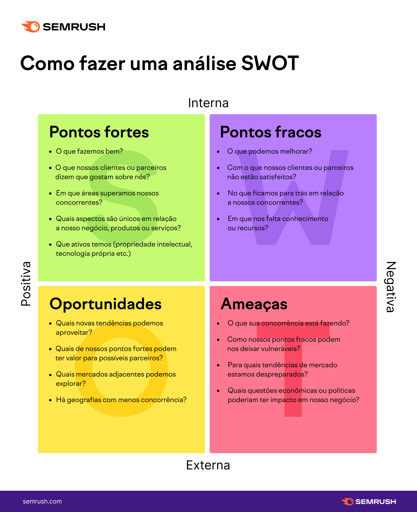

Estudos Avançados em Matemática e suas Tecnologias

&nbsp;

<h1 align="center">Matriz SWOT</h1>
<h4 align="center">Prof. Eduardo Ono</h4>
<h6 align="center">Atualizado em: 07/11/2024</h6>

&nbsp;

| S | W | O | T |
| :-: | :-: | :-: | :-: |
| Strengths | Weaknesses | Opporrtunities | Threats |
| Forças | Fraquezas | Oportunidades | Ameaças |

&nbsp;

## Análise SWOT

### Guia Geral

Fonte: <https://pt.semrush.com/blog/analise-swot/>

&nbsp;
