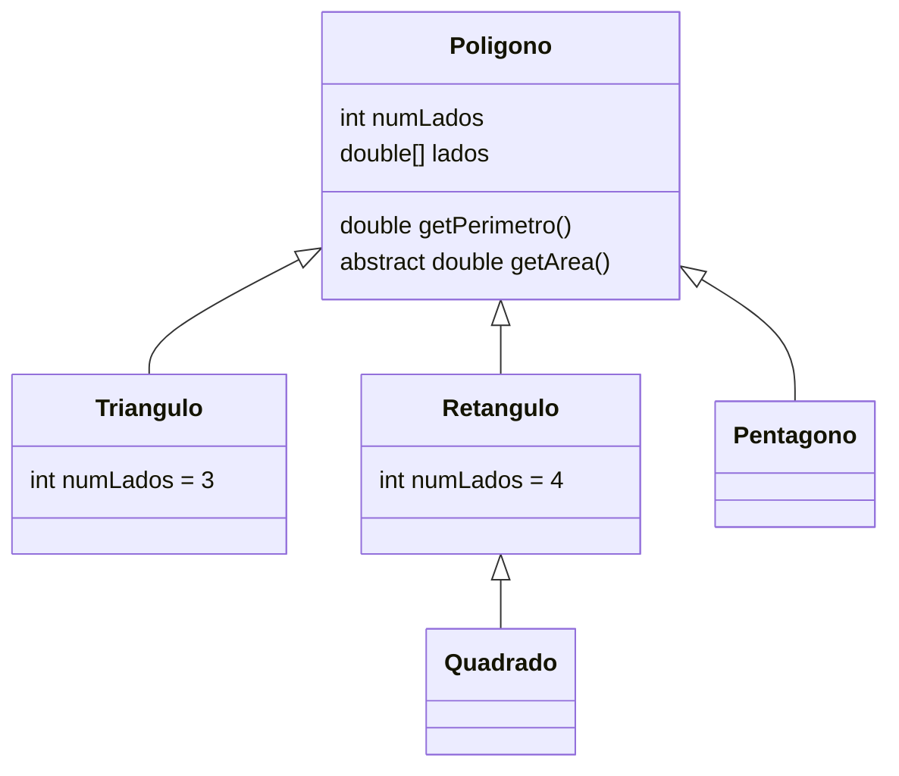

<h1 align="center">Java :: Fundamentos :: Classes Abstratas</h1>
<h3 align="center">Prof. Eduardo Ono</h3>
<h5 align="center">Atualizado em: 07/10/2024</h5>

&nbsp;

## Conceitos

* Podem incluir ou não métodos abstratos.
* Um __*método abstrato*__ é um método que é declarado sem a sua implementação (sem as chaves delimitadoras e seguido por um ponto-e-vírgula).

&nbsp;

## Exemplos

