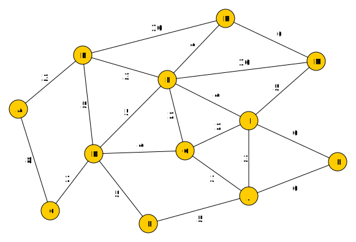

Estudos Avançados em Matemática e suas Tecnologias

&nbsp;

<h1 align="center">Lista de Exercícios - Algoritmo de Dijkstra</h1>
<h4 align="center">Prof. Eduardo Ono</h4>
<h6 align="center">Atualizado em: 01/12/2024</h6>

&nbsp;

## Exercício 1

Dado o gráfico poderado a seguir, determine o menor caminho entre o vértice _A_ (vértice origem) e os demais vértices do grafo.

&nbsp;

## Exercício 2

No grafo do exercício anterior, escolha como origem um vértice diferente do vértice _A_ e determine o menor caminho entre o vértice escolhido e os demais vértices do grafo.

&nbsp;

## Exercício 3

Determinar a Matriz de Adjacências do grafo do Exercício 1.

&nbsp;
